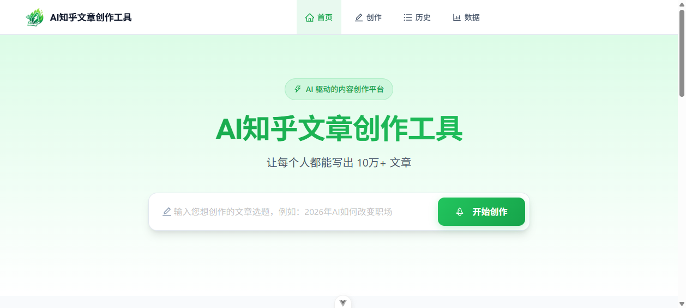
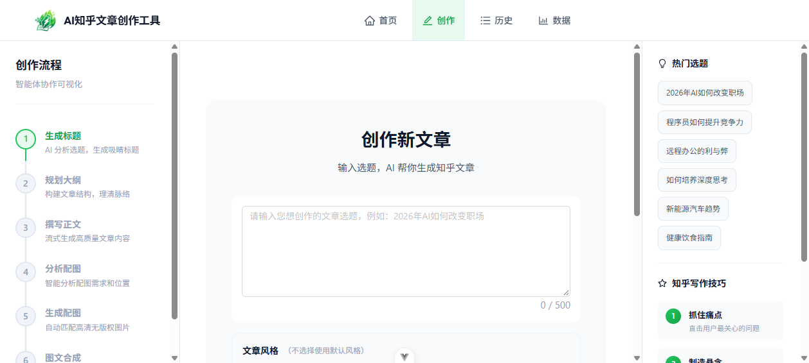
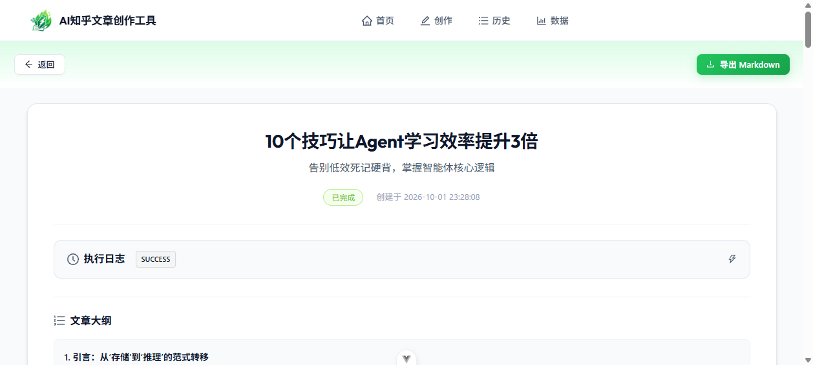
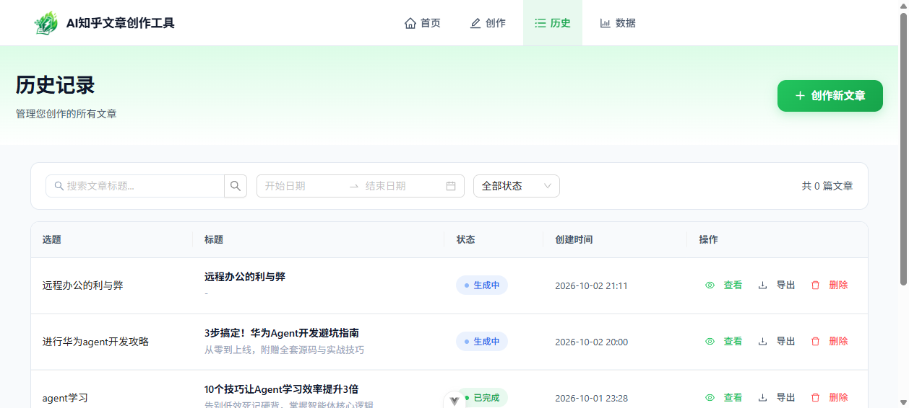
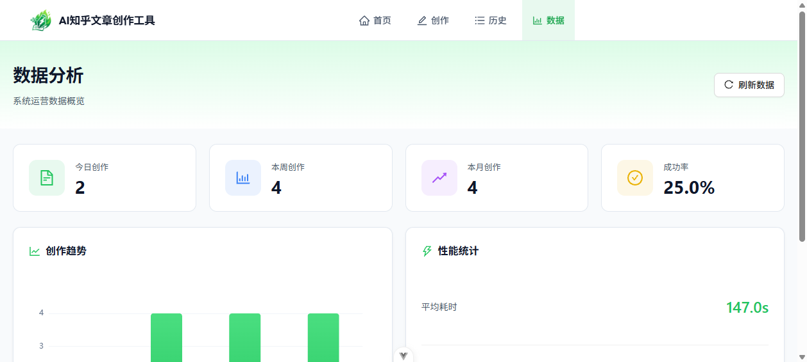

# AI 知乎文章创作工具

基于**多智能体协作**的 AI 文章创作平台，自动完成「选题 → 标题 → 大纲 → 正文 → 配图」全流程创作，并通过 **Human-in-the-loop** 交互让用户在每个关键阶段介入确认与编辑。

## 📸 界面预览

### 首页



### 创作流程（六智能体流水线）



### 文章详情（图文合成结果）



### 文章列表



### 数据统计



## ✨ 核心亮点

- **六智能体流水线编排**：将长文创作拆解为 6 个专职智能体，由 `ArticleAgentOrchestrator` 按三阶段流水线统一编排，每个智能体职责单一、可独立替换。
- **Human-in-the-loop 交互**：每个阶段产出后暂停，由用户确认或编辑后再进入下一阶段，避免长链路一次性生成跑偏。
- **阶段级断点恢复**：阶段间状态落库，下一阶段从数据库重建上下文，支持中断后从断点恢复。
- **正文与配图解耦（占位符方案）**：正文阶段由智能体插入占位符并输出结构化配图需求，配图阶段并行填充后按占位符合成，两条链路互不阻塞。
- **多配图来源策略模式**：5 种配图方式统一抽象 + 失败自动降级，统一上传 COS。
- **SSE 流式推送**：基于 `asyncio.Queue` 实现流式输出，规避代理层缓冲，处理客户端断连取消与队列清理。
- **全链路可观测**：每个智能体调用落库（Prompt、输入输出、耗时），支撑问题定位与性能分析。

## 🏗️ 架构设计

### 总体流程

```
选题输入
   │
   ▼
┌─ 阶段一（Phase 1）────────────────────────┐
│ Agent1 标题生成（3-5 个方案）             │
│    ↓                                      │
│ 用户确认标题 + 补充描述  ←─ Human-in-the-loop
└────────────────────────────────────────────┘
   │
   ▼
┌─ 阶段二（Phase 2）────────────────────────┐
│ Agent2 大纲生成（流式输出）               │
│    ↓                                      │
│ 用户编辑 / AI 修改 / 确认大纲  ←─ HITL
└────────────────────────────────────────────┘
   │
   ▼
┌─ 阶段三（Phase 3）────────────────────────┐
│ Agent3 正文生成（流式）                    │
│    ├─▶ Agent4 配图需求分析（插入占位符）   │
│    ├─▶ Agent5 并行配图生成（策略+并发）    │
│    └─▶ Agent6 图文合成（占位符回填）       │
└────────────────────────────────────────────┘
   │
   ▼
完整图文文章（Markdown）
```

### 分层架构

```
┌─────────────────────────────────────────────┐
│              前端 Vue 3 + Ant Design Vue     │
│  (创作页 / 列表 / 详情 / 统计，SSE 实时渲染)  │
└──────────────────┬──────────────────────────┘
                   │ HTTP / SSE
┌──────────────────▼──────────────────────────┐
│             FastAPI 路由层 (routers)         │
│  article / user / statistics / health        │
└──────────────────┬──────────────────────────┘
                   │
┌──────────────────▼──────────────────────────┐
│            业务服务层 (services)              │
│  ArticleService  ·  ArticleAgentService      │
│  ImageServiceStrategy  ·  AgentLogService    │
└──────────────────┬──────────────────────────┘
                   │
┌──────────────────▼──────────────────────────┐
│         多智能体编排层 (agent)                │
│  ArticleAgentOrchestrator (三阶段流水线)      │
│  Title/Outline/Content/ImageAnalyzer/         │
│  ParallelImageGenerator/ContentMerger        │
└──────────────────┬──────────────────────────┘
                   │
┌──────────────────▼──────────────────────────┐
│       基础设施：MySQL · Redis · COS          │
│        LLM 网关 · CogView · Pexels          │
└─────────────────────────────────────────────┘
```

### 关键设计：阶段状态机

文章生成过程由 `ArticlePhaseEnum` 状态机驱动，非法流转会被拒绝：

```
PENDING ─▶ TITLE_GENERATING ─▶ TITLE_SELECTING
                                       │
                                       ▼
CONTENT_GENERATING ◀─ OUTLINE_EDITING ◀─ OUTLINE_GENERATING
```

- 每个阶段开始时，后端从数据库读取上一阶段的产物，重建 `ArticleState` 上下文对象。
- 阶段产出通过 `save_title_options` / `save_outline` / `save_article_content` 落库，天然支持断点恢复。
- `ArticleState` 是贯穿六个智能体的共享状态对象，智能体之间通过它传递标题、大纲、正文、配图需求等中间产物。

### 关键设计：正文与配图解耦（占位符方案）

传统做法是"先生成全文，再统一配图"，导致配图成为串行瓶颈。本项目改为**占位符解耦**：

1. **Agent4（配图需求分析）**：阅读正文，在合适位置插入占位符 `{{IMAGE_PLACEHOLDER_N}}`（图片）或 `{{ICON_PLACEHOLDER_N}}`（行内图标），同时输出结构化配图需求（位置、图片来源、关键词、提示词）。
2. **Agent5（并行配图生成）**：用 `asyncio.gather` + `asyncio.Semaphore` 控制并发度，按配图需求并行调用不同配图来源，完成后按 `position` 排序保证输出稳定。
3. **Agent6（图文合成）**：遍历配图结果，将占位符替换为 `` 的 Markdown 图片语法。

两条链路互不阻塞，配图可并行、可失败降级，正文生成不受影响。代码中还处理了占位符的双层/四层花括号兼容归一化，避免替换残留。

### 关键设计：SSE 流式推送协议

前端通过 `EventSource` 连接 `/api/article/progress/{taskId}`，后端用 `asyncio.Queue` 解耦生成器与推送：

- **`SseEmitterManager`**：为每个 `taskId` 维护一个队列，`send()` 非阻塞投递，`complete()` 投递结束信号触发流关闭。
- **流式消息**：`AGENT2_STREAMING` / `AGENT3_STREAMING`（大纲/正文逐 token 推送，前端实时渲染打字机效果）。
- **阶段完成消息**：`AGENT1_COMPLETE` ~ `MERGE_COMPLETE`，携带各阶段产物（标题方案、大纲、配图需求、图片列表、完整图文）。
- **终止消息**：`ALL_COMPLETE` / `ERROR`。
- **反缓冲**：响应头设置 `X-Accel-Buffering: no`，规避 Nginx 等代理层的缓冲导致流式阻塞；`event_generator` 捕获 `asyncio.CancelledError` 处理客户端断连，并在 `finally` 中清理队列。

## 🛠️ 技术栈

| 层 | 技术 |
|---|---|
| 后端 | Python · FastAPI · SQLAlchemy · MySQL 8.0 · Redis |
| 前端 | Vue 3 · Vite 7 · TypeScript · Ant Design Vue · Pinia |
| AI | 中科大 LLM 网关（文本生成）· 智谱 CogView（AI 生图） |
| 基础设施 | Pexels（配图搜索）· 腾讯云 COS（图片存储） |

## 📁 目录结构

```
zhihu-article-tool/
├── backend/              # Python 后端（FastAPI）
│   ├── app/
│   │   ├── agent/        # 多智能体编排（orchestrator + 6 个 agent）
│   │   ├── routers/      # API 路由
│   │   ├── services/     # 业务服务（含配图策略模式）
│   │   ├── models/       # ORM 模型
│   │   ├── schemas/      # Pydantic 模型
│   │   └── managers/     # SSE 管理器
│   └── init_db.py        # 数据库初始化
├── frontend/             # Vue 3 前端（Vite）
│   └── src/
│       ├── pages/        # 页面（首页/创作/列表/详情/统计）
│       ├── components/   # 公共组件
│       └── utils/        # SSE 等工具
├── sql/                  # 建表脚本
├── docs/screenshots/     # 运行截图
├── start_all.py          # 一键启动脚本
└── start_all.bat         # Windows 双击启动入口
```

## 🚀 快速启动

### 环境要求

- Python 3.10+（推荐使用 `uv`）
- Node.js 18+
- MySQL 8.0、Redis

### 1. 准备数据库

```bash
# 创建数据库（或直接执行 sql/create_table.sql）
python backend/init_db.py
```

### 2. 配置环境变量

```bash
cp backend/.env.example backend/.env
# 编辑 backend/.env，填入各 AI 服务的密钥
```

### 3. 启动后端

```bash
cd backend
uv run uvicorn app.main:app --port 8567
```

### 4. 启动前端

```bash
cd frontend
npm install
npm run dev
```

浏览器访问 http://localhost:5173/

> 也可直接双击根目录 `start_all.bat` 一键启动（自动按序启动 MySQL → Redis → 后端 → 前端，端口检测避免重复启动）。

## 🧩 核心模块说明

### 多智能体编排（`backend/app/agent/`）

6 个专职智能体通过 `ArticleAgentOrchestrator` 编排，每个智能体职责单一、可独立替换：

| 智能体 | 文件 | 职责 |
|---|---|---|
| `TitleGeneratorAgent` | `agents/title_generator.py` | 生成 3-5 个标题方案供用户选择 |
| `OutlineGeneratorAgent` | `agents/outline_generator.py` | 流式生成文章大纲 |
| `ContentGeneratorAgent` | `agents/content_generator.py` | 流式生成正文（Markdown） |
| `ImageAnalyzerAgent` | `agents/image_analyzer.py` | 分析配图需求，在正文插入占位符 |
| `ParallelImageGenerator` | `parallel/image_generator.py` | 并发生成配图（信号量控制并发度） |
| `ContentMergerAgent` | `agents/content_merger.py` | 按占位符将配图回填到正文 |

编排器按三阶段串联智能体，每个阶段执行完后通过 `StreamHandlerContext.emit()` 广播阶段完成事件，驱动前端切换到下一阶段的交互界面。

### 配图策略模式（`backend/app/services/image_service_strategy.py`）

5 种配图来源统一抽象为 `ImageSearchService` 接口，通过策略模式注册与路由：

| 来源 | 枚举值 | 适用场景 | 实现 |
|---|---|---|---|
| Pexels | `PEXELS` | 真实场景、产品、风景等写实图片 | 关键词检索图库 |
| 智谱 CogView | `NANO_BANANA` | 创意插画、信息图、AI 生图 | OpenAI 兼容 images 接口 |
| Iconify | `ICONIFY` | 图标、符号、装饰性小图 | 图标库检索 |
| 表情包搜索 | `EMOJI_PACK` | 表情包、幽默配图 | Bing 图片搜索 |
| SVG 示意图 | `SVG_DIAGRAM` | 概念图、思维导图、逻辑关系 | LLM 生成 SVG 代码 |

**核心机制**：
- `ImageServiceStrategy.get_image_and_upload()` 统一处理"获取图片 → 上传 COS → 失败降级"全流程。
- 任一来源获取失败或服务不可用时，自动降级到占位图（Picsum）并同样上传 COS，保证文章永远有图。
- 所有配图最终统一落到腾讯云 COS，返回稳定的 CDN URL。
- 用户可在创建文章时通过 `enabledImageMethods` 限制可用配图方式，Agent4 据此筛选。

### 数据库模型（`backend/app/models/`）

| 表 | 用途 | 关键字段 |
|---|---|---|
| `article` | 文章任务主表 | `taskId`（UUID 唯一键）、`status`、`phase`、标题/大纲/正文/配图、`errorMessage` |
| `agent_log` | 智能体执行日志 | `agentName`、`prompt`、`inputData`、`outputData`、`durationMs`、`status` |

### 智能体日志与可观测（`agent_log_service.py`）

每个智能体调用通过 `_agent_log_context` 上下文管理器自动记录：开始/结束时间、耗时、Prompt、输入输出、成功/失败状态。日志通过 `asyncio.create_task` 异步落库，不阻塞主执行链路。前端文章详情页通过 `/article/execution-logs/{taskId}` 接口读取，可视化展示各智能体耗时与状态，用于定位慢智能体或失败环节。

## 📄 许可证

MIT License
